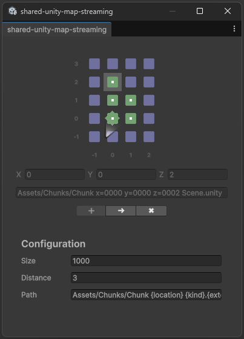
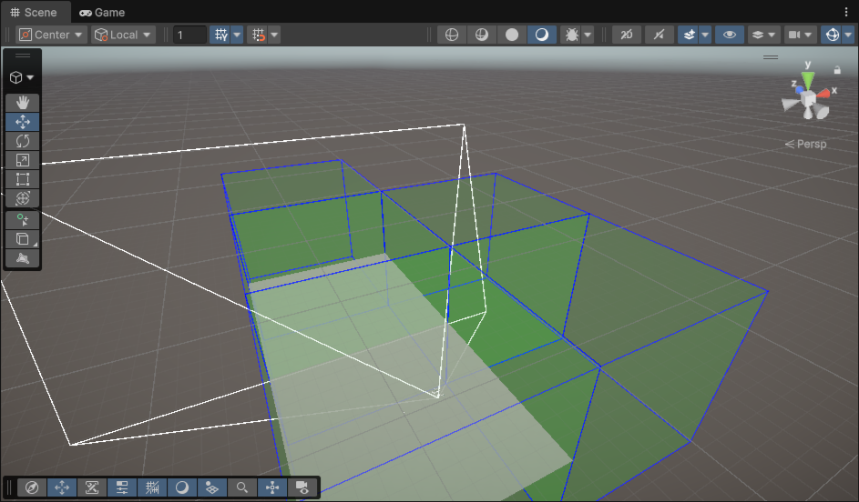

> [!important]
> Work in progress.

# shared-unity-map-streaming

A personal solution for segmenting a larger seamless world into many scenes which are loaded dynamically both in game and in editor.

Use the plugin window to create scenes representing cubes in the game world.
These scenes are loaded and unloaded as the player or editor camera moves through space.

Keep the player and other persistent game objects in a root scene.

## Setup

1. Configure values from the menu `Plugins/shared-unity-map-streaming`.
2. Add the `Tracker` component to the main player camera.
